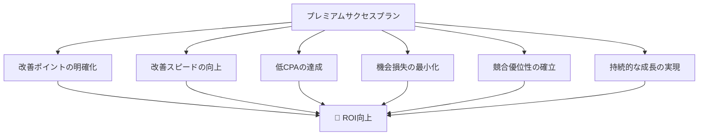

# 🚀 Premium Success Plan (プレミアムサクセスプラン)

<div align="center">
  
  
  
</div>

## 📊 リスティング広告運用の課題を解決

### ❌ こんな悩みはありませんか？

- **📈 広告費は使っているが、成果が見えない**
  - クリック数は多いが、コンバージョンに繋がらない
  - CPAが高騰し続けている
  - 競合に負けている感覚がある

- **📋 データはあるが、活用できていない**
  - Google Analyticsの数値を見ているだけ
  - 改善ポイントが分からない
  - PDCAサイクルが回せていない

- **🔗 広告とサイトの連携が取れていない**
  - 広告は運用しているがランディングページの内容を更新できていない
  - ユーザーの期待値とのギャップがある
  - 離脱率が高い

## 🎯 プレミアムサクセスプランが解決する3つの壁

<table>
<tr>
<td align="center">
<h3>🎯 広告とLPの不一致</h3>
<p>広告で入稿したキーワードがLPに反映されていない問題を解決</p>
<p><strong>結果:</strong> 品質スコアの向上</p>
</td>
<td align="center">
<h3>📊 データの断片化</h3>
<p>広告データとサイトデータを統合分析</p>
<p><strong>結果:</strong> 機会損失の最小化</p>
</td>
<td align="center">
<h3>⚡ 改善サイクルの停滞</h3>
<p>月1回のレポートから即時改善へ</p>
<p><strong>結果:</strong> 競合優位性の確立</p>
</td>
</tr>
</table>

## 🛠️ 対応媒体（リスティング広告から多様な広告まで）

### 🎯 顕在層向け（高CV期待）
- **Google リスティング広告** - 検索結果での即効性
- **Yahoo! リスティング広告** - 30代以上の購買層へアプローチ  
- **リマーケティング広告** - 既存訪問者への再アプローチ
- **Pmax広告** - Google全配信面への自動最適化

### 🌟 準顕在層〜潜在層向け
- **Meta広告 (Instagram/Facebook)** - 精度の高いターゲティング
- **X(旧Twitter)広告** - リアルタイム性の高い訴求
- **LINE広告** - 日本最大のメッセージプラットフォーム
- **YouTube広告** - 動画での没入感の高い訴求
- **TikTok広告** - 若年層への話題化
- **Pinterest広告** - 女性向け商材の訴求
- **DemandGeneration広告** - 長期的なブランディング

## 🔧 強力なツールセット

<div align="center">
  
| ツール | 機能 | 効果 |
|--------|------|------|
|  | サイト訪問者の属性・行動分析 | 流入傾向と離脱ポイントの特定 |
|  | 検索キーワードとクリック率 | 平均掲載順位とパフォーマンス |
|  | ヒートマップ・セッション録画 | ユーザー行動の可視化 |
|  | 高度な計測環境構築 | 長期的なデータ基盤整備 |

</div>

## 📋 サービス内容

### 🎯 月100ptの修正対応
```
💡 テキスト修正 4ヵ所 (25pt × 4)
🎨 バナー作成 1点 (100pt × 1)
※ポイントは使い切りとなります
```

### 📊 アクセス解析レポート
- Google Analytics & Search Consoleによる月次レポート
- サイト全体の状態確認と改善提案
- データに基づくカスタマイズされた戦略提案

### 🔥 ヒートマップ解析 (Clarity)
- ユーザーのクリック位置の可視化
- スクロール深度の分析  
- セッションレコーディングによる行動把握

### 🤝 任意MTG (月30分)
- Webコンサルタントによる解説
- Google Analyticsの操作方法指導
- 担当者のマーケティング知識向上支援

## 💰 料金体系

<div align="center">
  
### ¥15,000円（税抜）/月
**※ご契約期間は1年間**

</div>

## 🎯 期待効果

<div align="center">



</div>

## 📈 実施内容とプロセス

### 🔄 PDCA サイクルの実行

1. **📊 Plan（計画）** - MTGでの戦略調整
2. **🚀 Do（実行）** - GA4とGoogle広告の連携強化  
3. **🔍 Check（検証）** - 広告含むユーザー行動の把握
4. **⚡ Action（改善）** - 100ポイントでの即時改善

## 🌟 なぜプレミアムサクセスプランが必要なのか？

### 🏥 アクセス解析は健康診断

リスティング広告の最適化には、**専門家による総合的な診断**が不可欠です。

- 🔍 自然検索と広告流入の効果比較
- 🎯 キーワードとLPの一致度チェック
- 📊 品質スコア向上のための戦略立案
- 🚀 SEO対策との連携による相乗効果

## 🎉 今すぐ始めよう

プレミアムサクセスプランで、リスティング広告運用の課題を解決し、ページ内での回収効率を最大化しましょう！

---

<div align="center">
  
**🚀 お問い合わせ・お申し込みはこちら**

[](mailto:contact@example.com)
[](#)

</div>

---

> 💡 **アクセス解析は健康診断** - 定期的なチェックで広告運用の健全性を維持し、継続的な成長を実現します。

<div align="center">
  <small>© 2024 Premium Success Plan. All rights reserved.</small>
</div>