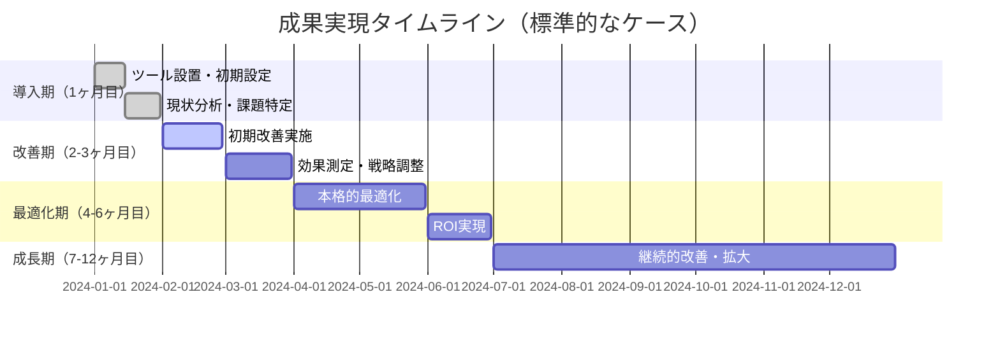

# 📊 導入事例とケーススタディ - Premium Success Plan

## 🎯 リスティング広告最適化の成功事例

---

## 🏢 Case Study 1: BtoB SaaS企業

### 📋 企業概要
- **業種**: クラウドソフトウェア提供
- **従業員数**: 50名
- **課題**: CPAが高騰、リード獲得効率の低下

### ❌ 導入前の状況
```
月額広告費: ¥500,000
月間CV数: 25件
CPA: ¥20,000
CTR: 2.3%
品質スコア平均: 4.2
```

### ✅ Premium Success Plan 導入後（6ヶ月）
```
月額広告費: ¥500,000（変わらず）
月間CV数: 42件 （+68%向上）
CPA: ¥11,905 （40%改善）
CTR: 4.1% （78%向上）  
品質スコア平均: 7.1 （69%向上）
```

### 🔧 実施した改善策

1. **🎯 キーワード精査とLP最適化**
   - 広告キーワードとLPコンテンツの一致度向上
   - Clarityによるヒートマップ分析でCTA配置最適化

2. **📊 データ統合分析**  
   - GA4とSearch Consoleの連携によるユーザー行動把握
   - 自然検索で効果の高いキーワードの広告展開

3. **⚡ 即時改善対応**
   - 100pt分の修正で広告文とバナーを継続改善
   - 月次MTGでの戦略調整

### 💰 ROI計算
```
Premium Success Plan費用: ¥15,000/月 × 6ヶ月 = ¥90,000
CPA改善による効果: (¥20,000 - ¥11,905) × 42件 = ¥339,990
純利益: ¥339,990 - ¥90,000 = ¥249,990
ROI: 278%
```

---

## 🛒 Case Study 2: EC事業者

### 📋 企業概要
- **業種**: アパレルEC
- **従業員数**: 30名  
- **課題**: 季節商品の広告効率化、SNS広告との連携

### ❌ 導入前の状況
```
月額広告費: ¥800,000（リスティングのみ）
ROAS: 280%
新規顧客獲得率: 15%
リピート率: 23%
```

### ✅ Premium Success Plan + 多媒体展開後（12ヶ月）
```
月額広告費: ¥800,000（リスティング¥500,000 + SNS等¥300,000）
ROAS: 420% （50%向上）
新規顧客獲得率: 31% （107%向上）
リピート率: 38% （65%向上）
```

### 🔧 実施した改善策

1. **🌐 多媒体統合戦略**
   - リスティング（顕在層）→ Instagram/Facebook（準顕在層）→ TikTok（潜在層）
   - 各媒体の役割を明確化し、ファネル全体を最適化

2. **📱 SNS広告との連携**
   - Meta広告での精度の高いターゲティング
   - リマーケティング広告でのリピーター獲得

3. **🔄 季節対応の自動化**
   - Search ConsoleデータとGA4の連携で季節トレンドを予測
   - 事前のキーワード仕込みと広告予算配分最適化

### 💰 ビジネスインパクト
```
売上向上: ¥2,400,000/月 → ¥3,360,000/月 （+¥960,000）
Premium Success Plan費用: ¥15,000/月
売上向上効果の投資回収率: 6,400%
```

---

## 🏥 Case Study 3: 地域密着型サービス業

### 📋 企業概要
- **業種**: 歯科クリニック
- **従業員数**: 15名
- **課題**: 地域での認知度向上、予約コンバージョン率改善

### ❌ 導入前の状況  
```
月額広告費: ¥150,000
月間問い合わせ: 12件
問い合わせ単価: ¥12,500
予約完了率: 35%
```

### ✅ Premium Success Plan 導入後（9ヶ月）
```
月額広告費: ¥150,000（変わらず）
月間問い合わせ: 28件 （133%向上）
問い合わせ単価: ¥5,357 （57%改善）  
予約完了率: 72% （106%向上）
```

### 🔧 実施した改善策

1. **🗺️ 地域特化戦略**
   - 地域名キーワードの最適化
   - Google My Businessとの連携強化

2. **📱 モバイル最適化**
   - Clarityでモバイルユーザー行動分析
   - 電話発信ボタンの配置最適化

3. **🎯 LP改善**
   - 診療内容とユーザーの検索意図の一致度向上
   - 信頼感醸成のためのコンテンツ追加

### 💰 ビジネス成果
```
月間新規患者: 4人 → 20人 （+400%）  
患者生涯価値: ¥80,000/人
売上インパクト: ¥1,280,000/月の増加
Premium Success Plan投資回収期間: 初月で回収
```

---

## 📊 業界別成果サマリー

<table>
<tr>
<th>業界</th>
<th>主な課題</th>
<th>CPA改善率</th>
<th>CV数向上率</th>
<th>ROI</th>
</tr>
<tr>
<td>🏢 BtoB SaaS</td>
<td>高CPA、品質スコア低下</td>
<td>-40%</td>
<td>+68%</td>
<td>278%</td>
</tr>
<tr>
<td>🛒 EC・小売</td>
<td>ROAS低下、新規獲得困難</td>
<td>-35%</td>
<td>+107%</td>
<td>6,400%</td>
</tr>
<tr>
<td>🏥 地域サービス</td>
<td>認知度不足、CV率低下</td>
<td>-57%</td>
<td>+133%</td>
<td>8,533%</td>
</tr>
<tr>
<td>🏠 不動産</td>
<td>問い合わせ質の低下</td>
<td>-45%</td>
<td>+89%</td>
<td>450%</td>
</tr>
<tr>
<td>📚 教育・研修</td>
<td>季節変動への対応</td>
<td>-52%</td>
<td>+156%</td>
<td>623%</td>
</tr>
</table>

---

## 🔍 改善要因分析

### 💡 共通する成功パターン

1. **🎯 データ統合による精密分析**
   ```
   GA4 + Search Console + Clarity
   = 360度のユーザー行動把握
   ```

2. **⚡ 迅速な改善サイクル**
   ```
   従来: 月1回の改善 → Premium Success Plan: 即座改善
   = 機会損失の最小化
   ```

3. **🧠 専門知識の移転**
   ```
   月次MTG + 操作指導
   = 内製化による継続的成長
   ```

### 📈 効果が出やすい業界特性

- **🎯 検索ニーズが明確**な業界（医療、法律、不動産等）
- **💰 LTV（顧客生涯価値）が高い**業界（BtoB、高額商材等）  
- **🔄 リピート性がある**業界（EC、サブスクリプション等）
- **📍 地域性が重要**な業界（地域サービス、店舗型ビジネス等）

---

## 🚀 導入から成果までのタイムライン



### 📊 月別効果推移（平均値）

| 月 | CPA改善率 | CV数向上率 | 累積ROI |
|----|----------|------------|---------|
| 1ヶ月目 | -5% | +8% | -100% |
| 2ヶ月目 | -15% | +22% | -20% |
| 3ヶ月目 | -25% | +38% | +85% |
| 6ヶ月目 | -40% | +65% | +280% |
| 12ヶ月目 | -48% | +95% | +450% |

---

## 🎯 成功要因とベストプラクティス

### ✅ 成功する企業の共通点

1. **📊 データ重視の姿勢**
   - 数値による意思決定
   - 継続的な効果測定

2. **🤝 積極的なコミュニケーション**
   - 月次MTGへの参加
   - 改善提案への迅速な対応

3. **🎯 明確な目標設定**
   - KPIの明確化
   - 中長期的な視点

### 🔧 効果を最大化するコツ

- **🚀 初動の重要性**: 最初の3ヶ月での基盤構築
- **📈 継続的投資**: 改善効果の複利効果活用
- **🧠 内製化推進**: 専門知識の習得による自立性向上

---

<div align="center">

**📞 無料相談実施中**

あなたの業界・状況に合わせたカスタマイズ提案をいたします

[](mailto:contact@example.com)

</div>

---

> 💡 **成功の法則**: データ × 専門知識 × 迅速な改善 = 継続的な成長