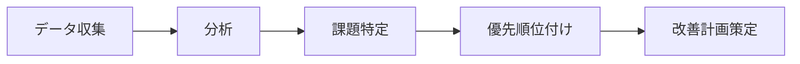
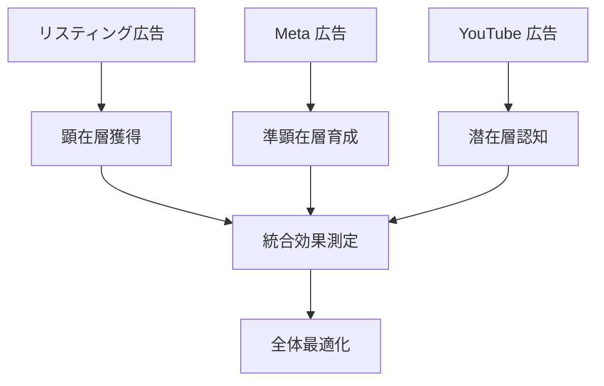

# 🚀 実装ガイド - Premium Success Plan

## 📋 導入から成果実現までの完全ロードマップ

---

## 🎯 Phase 1: 初期設定・診断フェーズ（1-2週目）

### 📊 現状分析とベースライン設定

#### Week 1: 環境構築
- **🔧 Google タグマネージャー設置**
  - 既存タグの整理・統合
  - コンバージョンタグの正確な設定
  - テスト環境での動作確認

- **📈 Google Analytics 4 設定最適化**
  - 目標設定の見直し
  - カスタムディメンション・メトリクス設定
  - レポート用セグメント作成

- **🔍 Search Console 連携強化**
  - サイトマップ登録確認
  - クロールエラーの修正
  - 重要ページのインデックス状況確認

#### Week 2: 分析ツール導入
- **🔥 Microsoft Clarity 設置**
  - トラッキングコードの設置
  - プライバシー設定の調整
  - 初期データ収集開始

- **📊 初期データ収集・分析**
  - 過去3ヶ月のパフォーマンス分析
  - 競合分析（可能な範囲で）
  - 課題の優先順位付け

### 📋 現状診断レポート作成



---

## ⚡ Phase 2: 初期改善実施フェーズ（3-6週目）

### 🎯 高インパクト施策の実行

#### Week 3-4: 広告とLP の一致度改善
- **🔍 キーワード・LP 監査**
  - 主要キーワードとランディングページの内容一致度チェック
  - ユーザー検索意図と LP コンテンツのギャップ分析
  - 改善優先度の高いページの特定

- **✏️ 100pt 修正対応（第1回）**
  - 重要 LP のテキスト修正（4箇所）
  - または新規バナー作成（1点）
  - CTA ボタンの配置・デザイン最適化

#### Week 5-6: データ統合と分析基盤強化
- **🔗 GA4 と Google 広告の連携強化**
  - オーディエンス共有設定
  - コンバージョンデータの双方向連携
  - 自動入札戦略への活用準備

- **📊 カスタムレポート作成**
  - 経営陣向けサマリーレポート
  - 運用担当者向け詳細レポート
  - 自動化可能な部分の設定

### 📈 初期成果測定

| 指標 | 目標改善率 | 測定方法 |
|------|-----------|----------|
| CTR | +15% | Google 広告レポート |
| 品質スコア | +1.0 | キーワード別分析 |
| 直帰率 | -10% | GA4 分析 |
| CPA | -20% | コンバージョンレポート |

---

## 🎯 Phase 3: 本格最適化フェーズ（7-12週目）

### 🚀 継続的改善サイクルの確立

#### 🔄 月次 PDCA サイクル

**Plan（計画）**
```
📊 前月データの詳細分析
🎯 今月の改善目標設定  
📋 施策の優先順位決定
📅 実施スケジュール策定
```

**Do（実行）**
```
⚡ 100pt 修正対応
🔧 広告設定の最適化
📝 新規コンテンツ作成
🎨 クリエイティブ改善
```

**Check（検証）**
```
📈 KPI 達成度評価
🔍 ヒートマップ分析
👥 ユーザー行動分析
💡 新たな課題発見
```

**Action（改善）**
```
📊 成功施策の横展開
🔄 失敗施策の修正
🎯 次月計画への反映
📚 ナレッジ蓄積
```

### 🎯 高度な最適化手法

#### A. 多媒体統合戦略


#### B. セグメント別アプローチ
- **🎯 新規顧客**: 認知拡大 → 信頼醸成 → 購入促進
- **🔄 既存顧客**: アップセル → クロスセル → LTV向上
- **😴 休眠顧客**: 再エンゲージメント → 復活促進

---

## 📊 Phase 4: 成果最大化フェーズ（3ヶ月目以降）

### 🏆 成果実現の加速

#### 月次成果レビュー会

**📅 毎月第1営業日実施（30分）**

1. **📊 前月実績レビュー**
   - KPI 達成状況の確認
   - 成功要因・改善要因の分析
   - ROI の算出と評価

2. **🔍 詳細データ分析**
   - GA4 レポートの詳細解説
   - ヒートマップから見えるユーザー行動
   - Search Console データの活用提案

3. **🚀 今月の戦略策定**
   - 優先改善項目の決定
   - 100pt 修正内容の相談
   - 新規施策の検討

4. **🎓 ナレッジ移転**
   - Google Analytics の操作指導
   - データ分析スキルの向上支援
   - 自立運用に向けた準備

### 📈 継続改善のメカニズム

#### 自動化による効率化
```
🤖 自動レポート生成
📊 異常値アラート設定
🔄 定型作業の自動化
📈 パフォーマンス監視
```

#### 専門知識の内製化
```
🎓 担当者スキル向上
📚 社内ナレッジ蓄積  
🔧 自立運用準備
🚀 発展的活用提案
```

---

## 🎯 成功指標とマイルストーン

### 📊 段階別成功指標

#### Phase 1（初期設定）
- [ ] 全ツールの正常稼働
- [ ] ベースラインデータの取得
- [ ] 課題の明確化と優先順位付け

#### Phase 2（初期改善）
- [ ] CTR 15%以上改善
- [ ] 品質スコア 1.0以上向上
- [ ] 直帰率 10%以上改善

#### Phase 3（本格最適化）
- [ ] CPA 30%以上改善
- [ ] CV数 50%以上向上
- [ ] ROI 200%以上達成

#### Phase 4（成果最大化）
- [ ] 継続的改善体制の確立
- [ ] 自立運用スキルの習得
- [ ] 新規チャネル展開の準備

### 🏁 最終目標

```
🎯 12ヶ月後の目標
├── CPA: 50%改善
├── CV数: 100%向上  
├── ROI: 500%達成
├── 内製化: 80%完了
└── 拡張準備: 完了
```

---

## 🚨 リスク管理と対策

### ⚠️ 想定リスクと対応策

#### 技術的リスク
| リスク | 対応策 | 予防策 |
|--------|--------|--------|
| タグ設定ミス | 即座修正・検証 | テスト環境での事前確認 |
| データ欠損 | バックアップから復旧 | 定期バックアップ実施 |
| ツール障害 | 代替手段で継続 | 複数ツールでの冗長化 |

#### 運用リスク
| リスク | 対応策 | 予防策 |
|--------|--------|--------|
| 効果の遅れ | 戦略見直し・加速 | 現実的目標設定 |
| 予算超過 | 配分調整・優先化 | 定期予算レビュー |
| 人的リソース不足 | サポート強化 | 内製化推進 |

### 🔄 継続的モニタリング

#### 週次チェック項目
- [ ] 主要KPIの数値確認
- [ ] 広告パフォーマンス監視
- [ ] エラー・問題の有無確認
- [ ] 競合動向のチェック

#### 月次レビュー項目  
- [ ] 目標達成度評価
- [ ] 改善施策の効果測定
- [ ] 次月計画の策定
- [ ] リスク要因の洗い出し

---

## 📞 サポート体制

### 🤝 コンタクト方法

#### 緊急時対応
- **📧 メール**: support@premiumsuccess.com
- **📱 電話**: 平日 9:00-18:00
- **💬 チャット**: 管理画面内チャット機能

#### 定期サポート
- **📅 月次MTG**: 第1営業日 30分
- **📊 月次レポート**: 毎月5日までに送付
- **🔧 修正対応**: 随時（100pt内）

#### 追加サポート
- **🎓 研修**: 別途対応可能
- **🔬 詳細分析**: 別途対応可能
- **🚀 拡張支援**: 別途対応可能

---

<div align="center">

**🎉 成功への道のりを一緒に歩みましょう！**

[](mailto:contact@example.com)

</div>

---

> 💡 **成功の秘訣**: 継続的な改善と専門家のサポートにより、必ず成果を実現できます。一歩ずつ着実に進んでいきましょう。