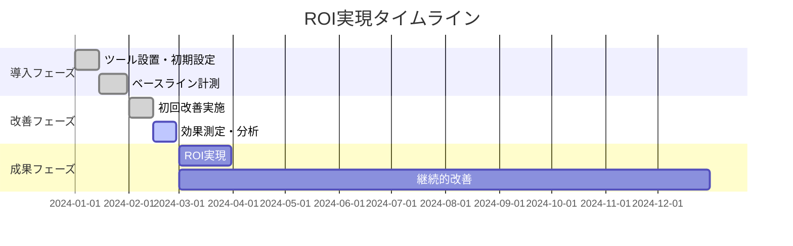

# 💰 料金とメリット - Premium Success Plan

## 💸 料金体系

<div align="center">
  
### 🎯 月額 ¥15,000円（税抜）
**※ご契約期間は1年間です**

<table>
<tr>
<td align="center">
<h3>💰 コスト効率</h3>
<p>月額15,000円で広告運用の専門サポート</p>
</td>
<td align="center">
<h3>📊 包括的サポート</h3>
<p>分析から改善まで一括対応</p>
</td>
<td align="center">
<h3>⚡ 即時対応</h3>
<p>100pt分の月次修正対応</p>
</td>
</tr>
</table>

</div>

---

## 🎁 サービス内容詳細

### 1. 📊 アクセス解析レポート

<div align="center">
  
</div>

- **Google Analytics & Search Console** による詳細レポート
- **月次送付** でサイト全体の状態を確認
- **改善提案** と **戦略調整** を含む

### 2. 🔥 ヒートマップ解析

<div align="center">
  
</div>

- **Microsoft Clarity** を導入してユーザー行動を可視化
- **クリック位置** と **スクロール深度** の分析
- **セッションレコーディング** による詳細な行動把握

### 3. ⚙️ Google タグマネージャー設置（特典）

<div align="center">
  
</div>

- **Webサイト運用に必要不可欠** なGoogleタグマネージャーを設置
- **長期目線で高度な計測環境** を構築
- **設定されていない場合が対象**

### 4. 🛠️ 毎月100pt分の修正対応

<div align="center">
  
</div>

| 修正内容 | 消費ポイント | 対応可能数 |
|----------|-------------|-----------|
| **📝 テキスト修正** | 25pt | 4ヵ所 |
| **🎨 バナー作成** | 100pt | 1点 |

> ⚠️ **注意**: ポイントは使い切りとなります

### 5. 🤝 任意MTG

<div align="center">
  
</div>

- **月30分の予約制**（ご希望の方のみ）
- **Webコンサルタント** による説明
- **Google Analytics の操作方法** も指導
- **担当者のマーケティング知識向上** をサポート

---

## 🎯 期待効果とROI

### 📈 直接的効果

<table>
<tr>
<td align="center">
<h3>📊 改善ポイントの明確化</h3>
<p>データに基づく具体的改善策</p>
</td>
<td align="center">
<h3>⚡ 改善スピードの向上</h3>
<p>月1回→即時改善への転換</p>
</td>
<td align="center">
<h3>💰 低CPAの達成</h3>
<p>費用対効果の最適化</p>
</td>
</tr>
<tr>
<td align="center">
<h3>📉 機会損失の最小化</h3>
<p>取りこぼしの防止</p>
</td>
<td align="center">
<h3>🏆 競合優位性の確立</h3>
<p>市場での差別化</p>
</td>
<td align="center">
<h3>🚀 持続的な成長の実現</h3>
<p>長期的な収益向上</p>
</td>
</tr>
</table>

### 💡 投資対効果（ROI）計算例

```
月額投資: ¥15,000
改善により削減される広告費無駄: ¥30,000〜¥50,000
純利益: ¥15,000〜¥35,000/月

年間ROI: 120%〜280%
```

---

## 🆚 他社サービスとの比較

<table>
<tr>
<th></th>
<th>🏆 Premium Success Plan</th>
<th>⭕ 他社A（月額30,000円）</th>
<th>❌ 他社B（月額25,000円）</th>
</tr>
<tr>
<td><strong>料金</strong></td>
<td>💰 ¥15,000/月</td>
<td>💸 ¥30,000/月</td>
<td>💸 ¥25,000/月</td>
</tr>
<tr>
<td><strong>レポート頻度</strong></td>
<td>📊 月次 + 即時対応</td>
<td>📊 月次のみ</td>
<td>📊 月次のみ</td>
</tr>
<tr>
<td><strong>修正対応</strong></td>
<td>✅ 100pt/月</td>
<td>❌ 別途費用</td>
<td>❌ 別途費用</td>
</tr>
<tr>
<td><strong>ヒートマップ</strong></td>
<td>✅ 包含</td>
<td>❌ 別途費用</td>
<td>❌ 未対応</td>
</tr>
<tr>
<td><strong>GTM設置</strong></td>
<td>✅ 特典</td>
<td>❌ 別途費用</td>
<td>❌ 未対応</td>
</tr>
<tr>
<td><strong>コンサル対応</strong></td>
<td>✅ 月30分</td>
<td>❌ 別途費用</td>
<td>❌ 未対応</td>
</tr>
</table>

---

## 🎯 コストパフォーマンス分析

### 💸 従来の課題（プラン導入前）

```
❌ 月1回のレポートのみ: 改善タイミングの遅れ
❌ データ断片化: 機会損失の発生  
❌ 修正対応別料金: 追加コストの発生
❌ 専門知識不足: 効果的な施策の実施困難
```

### ✅ Premium Success Plan 導入後

```
✅ 即時改善対応: 機会損失の最小化
✅ 統合データ分析: 精度の高い改善施策
✅ 月次修正包含: 追加コスト不要
✅ 専門家サポート: 継続的な知識向上
```

### 📊 ROI実現までの期間



---

## 💎 付加価値サービス

### 🎓 教育・トレーニング
- **Google Analytics 操作指導**
- **マーケティング知識の向上支援**  
- **データ分析スキルの習得サポート**

### 🔧 技術サポート
- **高度な計測環境構築**
- **BigQuery 連携設定（別途対応）**
- **探索レポート作成（別途対応）**

### 📈 戦略コンサルティング
- **競合分析と市場ポジショニング**
- **長期的な成長戦略立案**
- **新規チャネル開拓支援**

---

## 🚀 今すぐ始めるべき理由

### ⏰ 時間価値
- **1日遅れるごとに機会損失が発生**
- **早期導入で競合優位性を確立**

### 💰 コスト効率
- **月額15,000円で専門チーム相当のサポート**
- **追加コスト不要の包括的サービス**

### 🎯 確実な成果
- **データ駆動型の改善アプローチ**
- **継続的なPDCAサイクル**

---

<div align="center">
  
**🎉 特別オファー**

初回契約時に**設定サポート無料**！  
通常別途費用のGoogle タグマネージャー設置を無料で実施

[](mailto:contact@example.com)

</div>

---

> 💡 **投資としてのマーケティング**: Premium Success Planは単なる費用ではなく、継続的な成長を実現する投資です。