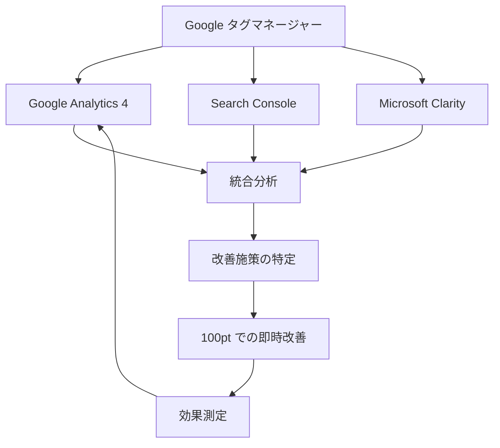

# 🛠️ ツール概要 - Premium Success Plan

## 🚀 広告運用を支えるGoogle の強力なツール

プレミアムサクセスプランが広告運用をサポートできるのは、**3つの強力な分析ツール**で徹底したアクセス解析環境を構築するからです。

---

## 📊 Google Analytics 4 (GA4)

  

### 🎯 主な機能
- **👥 サイト訪問者の属性・行動**
  - ユーザーの年齢、性別、興味関心の分析
  - 行動パターンとコンバージョン経路の把握

- **📈 流入の傾向**
  - どのチャネルからユーザーが流入しているか
  - 時間別、曜日別の流入パターン分析

- **🚪 離脱ポイントの特定**
  - どのページで離脱が多いか
  - コンバージョンファネルの詳細分析

### 💡 Premium Success Plan での活用
- GA4とGoogle広告の連携強化
- 広告含むユーザー行動の把握
- GA4探索カスタムレポートの作成（別途対応可能）

---

## 🔍 Google Search Console

  

### 🎯 主な機能
- **🔑 検索キーワードとクリック率**
  - どのキーワードで検索されているか
  - キーワード別のクリック率とインプレッション数

- **📍 平均掲載順位**
  - 各キーワードでの検索順位
  - 順位変動のトレンド分析

- **📄 ページごとのパフォーマンス**
  - ページ別のクリック数とインプレッション数
  - 検索パフォーマンスの詳細分析

### 💡 Premium Success Plan での活用
- 自然検索で成功しているキーワードの広告展開検討
- 広告キーワードのSEO対策への反映
- 検索パフォーマンスと広告効果の相関分析

---

## 🔥 Microsoft Clarity（ヒートマップ）

  

### 🎯 主な機能
- **🖱️ ユーザーのクリック位置**
  - ページ上でユーザーがクリックした箇所の可視化
  - クリックの多い箇所と少ない箇所の特定

- **📏 スクロール深度**
  - ユーザーがページをどこまで読んでいるか
  - コンテンツの読まれ具合の把握

- **🎬 セッションレコーディング**
  - ユーザーのWebサイト上の動きを録画
  - 個別のセッションを再生して分析

### ✨ Clarity の特徴
- **🆓 無料で利用できる**ウェブ解析ツール
- **👁️ ユーザー行動の可視化**が可能
- **🔍 Google Analytics だけでは分析しきれない**ユーザー行動を把握

### 💡 Premium Success Plan での活用
- ランディングページの改善点特定
- ユーザビリティの向上提案
- 広告とLP の一致度向上のための具体的施策

---

## ⚙️ Google タグマネージャー設置（特典）

  

### 🎯 サービス内容
- **🏗️ Webサイト運用に必要不可欠**なGoogle タグマネージャーを設置
- **📊 長期目線で高度な計測環境**を早めに構築
- **🔧 より高度な解析に必要なBigQuery や探索レポート**の設定も別途可能

### 💡 設置効果
- タグの一元管理による効率化
- 正確なコンバージョン計測
- 将来的な拡張性の確保

---

## 🎯 専門家によるリスティング広告及びHP の総合的な診断

### 📋 月次診断内容

経験豊富なコンサルタントが毎月のレポートで変化を定点観測し、以下の診断を実施：

- **🔍 自然検索と広告流入の効果比較**
  - 広告の流入はどれくらい効果を発揮しているか
  - 自然検索との相乗効果の分析

- **🎯 キーワードとLP の一致度チェック**
  - 入稿しているキーワードとLP の内容が一致しているか
  - 広告の品質は高まっているか

- **💡 戦略的キーワード提案**
  - 自然検索で成功しているキーワードを広告で入稿すべきか
  - 広告で入稿しているキーワードでSEO対策をすると流入が見込めるか

- **📊 数値に基づくカスタマイズされた戦略**を提案

---

## 🤝 任意MTG（月30分の予約制）

### 👨‍💼 Webコンサルタントによるサポート
- **📊 アクセス解析レポート**の詳細説明
- **🔥 ヒートマップ解析**の見方と活用法
- **📈 Google Analytics の操作方法**も説明
- **🎓 担当者がマーケティングに詳しくなる**ことも可能

---

## 🎯 ツール連携による相乗効果

### 🔄 継続的改善サイクル
1. **📊 データ収集** - 各ツールからの包括的データ取得
2. **🔍 分析** - 専門家による総合的な診断
3. **💡 施策立案** - データに基づく具体的改善策
4. **⚡ 即時実行** - 100pt での迅速な改善実施
5. **📈 効果測定** - 改善結果の定量的評価

---

> 💡 **アクセス解析は健康診断** - 定期的なチェックで広告運用の健全性を維持し、継続的な成長を実現します。